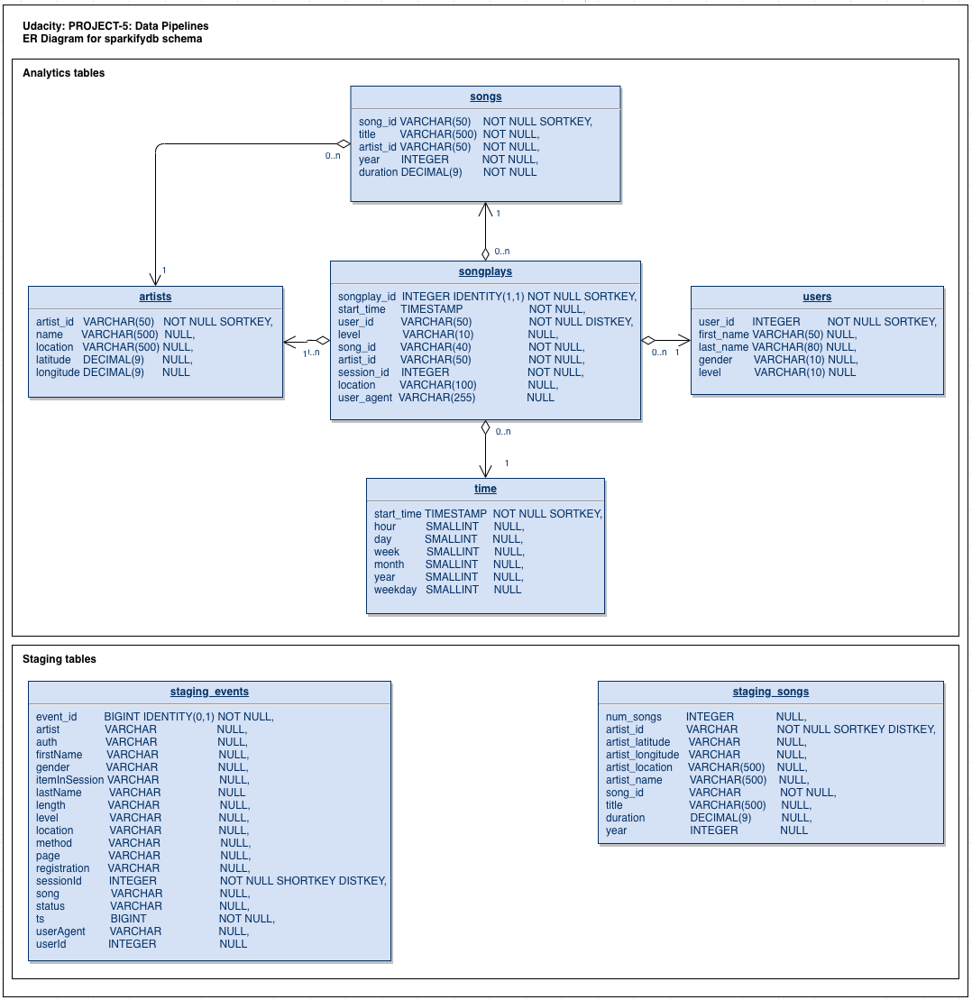

<h3>Purpose</h3>

The pupose of this application is to deliver data from an S3 bucket to fact and dimensional tables
in Redshift data warehouse through a data pipeline using Apache Airflow to schedule batch Extractions,
Transformation, and Loading.

<h3>About Database</h3>

Sparkify analytics database (called here sparkifydb) schema has a star design. Start design means that it has one Fact Table having business data, and supporting Dimension Tables. Star DB design is maybe the most common schema used in ETL pipelines since it separates Dimension data into their own tables in a clean way and collects business critical data into the Fact table allowing flexible queries. The Fact Table answers one of the key questions: what songs users are listening to. DB schema is the following:

<h3>HOW TO USE</h3>

<strong>The project has two DAGs:</strong>

<ul>
    <li><strong>create_table</strong>dag: This DAG uses the 'create_tables.sql' file to
    create the required tables.</li>
    <li><strong>udac_example_dag:</strong> This DAG uses data in s3:/udacity-dend/song_data and s3:/udacity-dend/log_data, processes it, and inserts the processed data into AWS Redshift DB. </li>
</ul>
<h4>Setup</h4>

# Setup Json Path
<ul>
    <li>
    Create an object key within the S3 bucket <strong>udacity-dend2-mogo</strong>. Name it 
    <strong>jsonpaths</strong>.
    </li>
    <li>
    Upload the two JSON files "jpath.json" and "jsonpath_songs.json" into this new key,
    <strong>jsonpaths</strong>
    </li>
</ul>

# Create Tables
<ul>
    <li>
    Copy "create_tables.sql" file into <strong>"/tmp/"</strong> directory
    </li>
    <li>
    Then, from Airflow UI, run the "create_table" DAG located in "to_redshift.py" file.
    </li>
    <li>
    This will create ALL required tables in AWS Redshift
    </li>
</ul>

